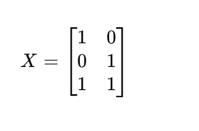
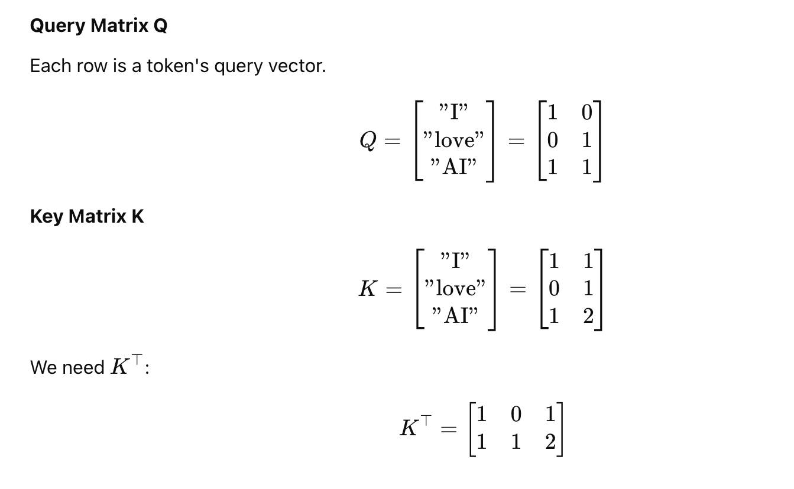
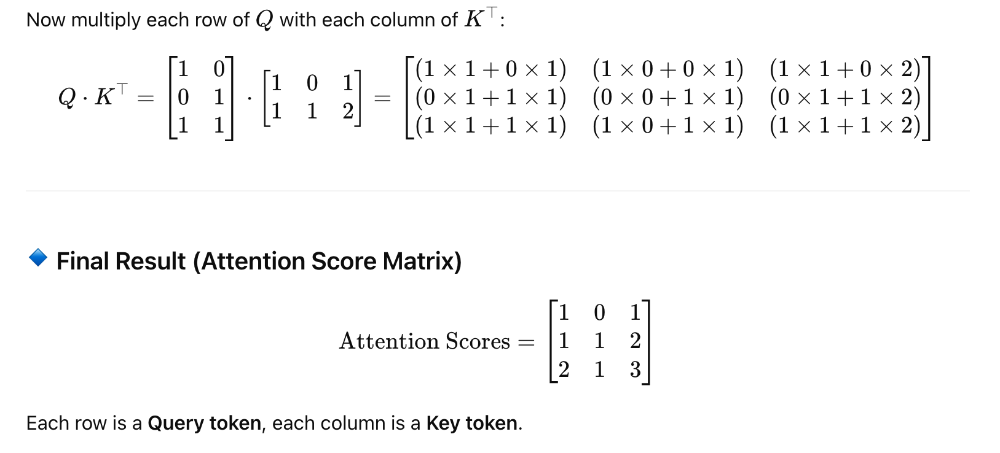

# Self-Attention

1. Tokenization

2. Embeddings

3. Queries, Keys, Values

4. Attention scores

5. Softmax weights

6. Weighted sum

7. Final output

<br> <br>

## 1. Tokenization

What is tokenization?

It splits text into pieces the model can understand — called tokens.

Example:

```python
"I love AI" → ["I", "love", "AI"]
#→ Token IDs: [101, 102, 103]  (just example numbers)
```

Each token gets a unique ID from the model's vocabulary.

<br> <br> <br>

## 2. Embeddings
What is embedding?

It's a way to turn token IDs into vectors of real numbers that capture meaning.

The model has an embedding table:

 - Rows = tokens (like 30,000 total)

 - Columns = dimensions (like 768 or **2 in our toy example**)

```python
[ vocabulary_size, embedding_dim ]

Embedding Table = [30,000 × 768]
```

Example:

If token ID 42 = "love", the model finds the 42nd row in this table:

```python
Embedding of "love" = embedding_table[42] = [0.12, -0.56, ..., 0.07]  (length = 768)
```

<br>

Each token ID maps to a vector.


| Token ID | Word   | Embedding |
| -------- | ------ | --------- |
| 101      | "I"    | \[1, 0]   |
| 102      | "love" | \[0, 1]   |
| 103      | "AI"   | \[1, 1]   |



These numbers start random and are learned during training so that similar words get similar vectors.


##  How Does It Work?
Imagine this:

 - You have a vocabulary of, say, 30,000 tokens (like GPT or BERT).

 - You want each token to be represented by a vector of 768 numbers (common in large models).

So, you create a matrix of shape:

| Token ID | Embedding Vector (initially random) |
| -------- | ----------------------------------- |
| 101      | \[0.15, -0.32, 0.67, ..., 0.04]     |
| 102      | \[-0.12, 0.21, -0.98, ..., -0.50]   |
| ...      | ...                                 |


## At first, the vectors are random numbers

But during training, the model updates these vectors (using backpropagation) so that:

**Similar words (like "cat" and "kitten") move closer together.**

Words used in similar contexts get similar vectors.


<br> <br> <br> <br>


## 3. Queries (Q), Keys (K), Values (V)

For each word vector (embedding), we create:

| Vector | Role                            | Meaning                         |
| ------ | ------------------------------- | ------------------------------- |
| Query  | What this word is looking for   | e.g. "Who’s relevant to me?"    |
| Key    | What this word offers to others | e.g. "What info do I provide?"  |
| Value  | What info this word carries     | e.g. "Here’s my actual content" |

We use learned weight matrices to create Q, K, and V from each embedding.

Let’s use small 2×2 matrices for this toy example:

**All those projection matrices are initialized randomly when the model is first created.**

These include:

 - W_Q (Query weights)

 - W_K (Key weights)

 - W_V (Value weights)

And also weights for:

 - The final linear layer after attention

 - Feedforward layers, etc.

```python
W_Q = [[1, 0],
       [0, 1]]

W_K = [[1, 1],
       [0, 1]]

W_V = [[1, 2],
       [2, 1]]
```


🔸 "I" = [1, 0]

Q = [1, 0] × W_Q = [1, 0]

K = [1, 0] × W_K = [1, 1]

V = [1, 0] × W_V = [1, 2]


<br>

🔸 "love" = [0, 1]

Q = [0, 1] × W_Q = [0, 1]

K = [0, 1] × W_K = [0, 1]

V = [0, 1] × W_V = [2, 1]

<br>

🔸 "AI" = [1, 1]

Q = [1, 1] × W_Q = [1, 1]

K = [1, 1] × W_K = [1, 2]

V = [1, 1] × W_V = [3, 3]

<br>

| Token | Embedding | Query (Q) | Key (K) | Value (V) |
| ----- | --------- | --------- | ------- | --------- |
| I     | \[1, 0]   | \[1, 0]   | \[1, 1] | \[1, 2]   |
| love  | \[0, 1]   | \[0, 1]   | \[0, 1] | \[2, 1]   |
| AI    | \[1, 1]   | \[1, 1]   | \[1, 2] | \[3, 3]   |

<br>


<br><br><br>


## 4. Compute Attention Scores

We’ll now calculate how much each word should attend to every other word.

This is done by computing the dot product of Query (Q) and Key (K).


 
Where:

 - Q = Query matrix of shape (3 × 2)

 - K = Key matrix of shape (3 × 2) ⇒ so **transpose** is (2 × 3)

Result: (3 × 3) matrix = score each token gives to every token



<br>



<br>


|             | **K: I** | **K: love** | **K: AI** |
| ----------- | -------- | ----------- | --------- |
| **Q: I**    | 1        | 0           | 1         |
| **Q: love** | 1        | 1           | 2         |
| **Q: AI**   | 2        | 1           | 3         |


<br><br><br>


## 5. Softmax Weights


