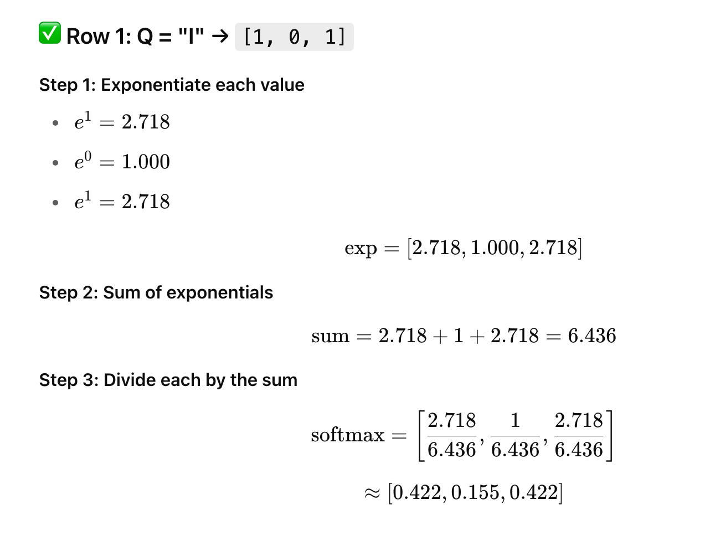
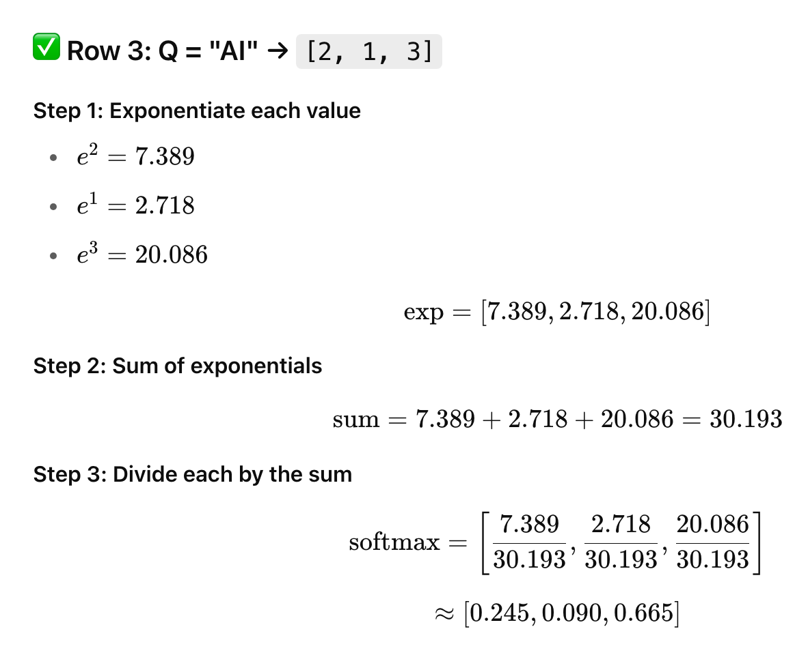
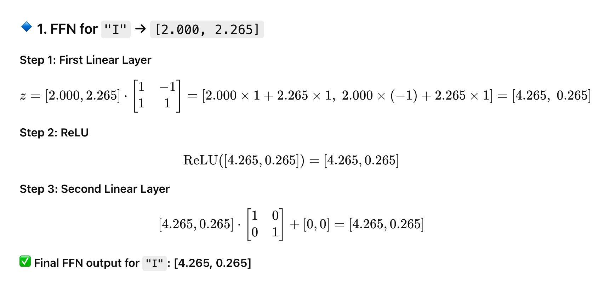
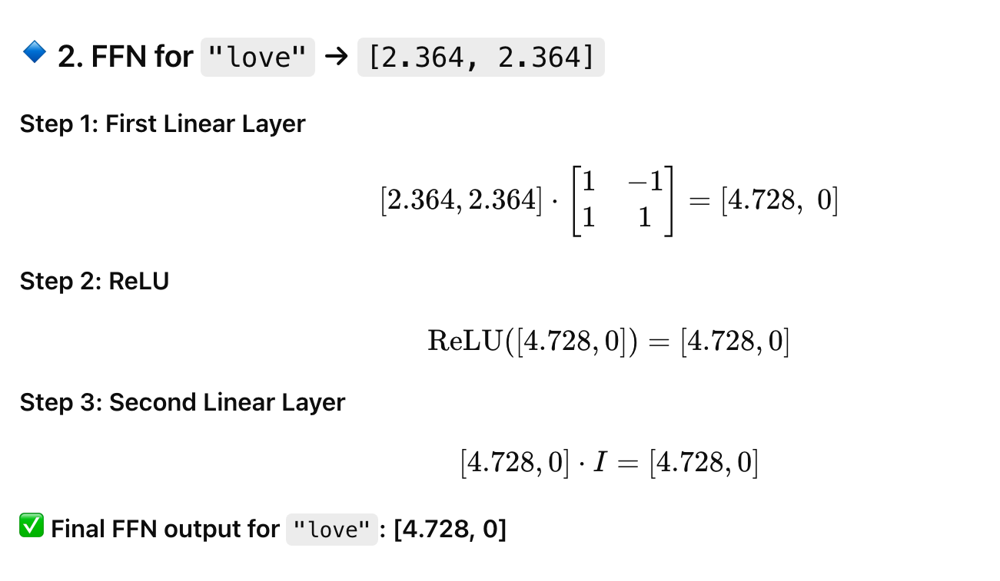

# Self-Attention

1. Tokenization

2. Embeddings

3. Queries, Keys, Values

4. Attention scores

5. Softmax weights

6. Weighted sum

7. Final output

<br> <br>

# <> 1. Tokenization

What is tokenization?

It splits text into pieces the model can understand — called tokens.

Example:

```python
"I love AI" → ["I", "love", "AI"]
#→ Token IDs: [101, 102, 103]  (just example numbers)
```

Each token gets a unique ID from the model's vocabulary.

<br> <br> <br>

# <> 2. Embeddings
What is embedding?

It's a way to turn token IDs into vectors of real numbers that capture meaning.

The model has an embedding table:

 - Rows = tokens (like 30,000 total)

 - Columns = dimensions (like 768 or **2 in our toy example**)

```python
[ vocabulary_size, embedding_dim ]

Embedding Table = [30,000 × 768]
```

Example:

If token ID 42 = "love", the model finds the 42nd row in this table:

```python
Embedding of "love" = embedding_table[42] = [0.12, -0.56, ..., 0.07]  (length = 768)
```

<br>

Each token ID maps to a vector **(In our exmaple we only have length = 2)**.


| Token ID | Word   | Embedding |
| -------- | ------ | --------- |
| 101      | "I"    | \[1, 0]   |
| 102      | "love" | \[0, 1]   |
| 103      | "AI"   | \[1, 1]   |


These numbers start random and are learned during training so that similar words get similar vectors.

| Stage           | Are Embeddings Random? | Description                        |
| --------------- | ---------------------- | ---------------------------------- |
| Before training | ✅ Yes                  | Randomly initialized               |
| During training | 🔄 Updating            | Learned by minimizing model loss   |
| After training  | ❌ No                   | Meaningful, task-optimized vectors |

But during training, the model updates these vectors (using backpropagation) so that:

**Similar words (like "cat" and "kitten") move closer together.**

Words used in similar contexts get similar vectors.

<br>


## How Does It Work?
Imagine this:

 - You have a vocabulary of, say, 30,000 tokens (like GPT or BERT).

 - You want each token to be represented by a vector of 768 numbers (common in large models).

So, you create a matrix of shape:

| Token ID | Embedding Vector (initially random) |
| -------- | ----------------------------------- |
| 101      | \[0.15, -0.32, 0.67, ..., 0.04]     |
| 102      | \[-0.12, 0.21, -0.98, ..., -0.50]   |
| ...      | ...                                 |


<br> <br> <br> <br>


# <> 3. Queries (Q), Keys (K), Values (V)

For each word vector (embedding), we create:

| Vector | Role                            | Meaning                         |
| ------ | ------------------------------- | ------------------------------- |
| Query  | What this word is looking for   | e.g. "Who’s relevant to me?"    |
| Key    | What this word offers to others | e.g. "What info do I provide?"  |
| Value  | What info this word carries     | e.g. "Here’s my actual content" |

We use learned weight matrices to create Q, K, and V from each embedding.

Let’s use small 2×2 matrices for this toy example:

**All those projection matrices are initialized randomly when the model is first created.**

These include:

 - W_Q (Query weights)

 - W_K (Key weights)

 - W_V (Value weights)

And also weights for:

 - The final linear layer after attention

 - Feedforward layers, etc.

```python
W_Q = [[1, 0],
       [0, 1]]

W_K = [[1, 1],
       [0, 1]]

W_V = [[1, 2],
       [2, 1]]
```


🔸 "I" = [1, 0]

Q = [1, 0] × W_Q = [1, 0]

K = [1, 0] × W_K = [1, 1]

V = [1, 0] × W_V = [1, 2]


<br>

🔸 "love" = [0, 1]

Q = [0, 1] × W_Q = [0, 1]

K = [0, 1] × W_K = [0, 1]

V = [0, 1] × W_V = [2, 1]

<br>

🔸 "AI" = [1, 1]

Q = [1, 1] × W_Q = [1, 1]

K = [1, 1] × W_K = [1, 2]

V = [1, 1] × W_V = [3, 3]

<br>

| Token | Embedding | Query (Q) | Key (K) | Value (V) |
| ----- | --------- | --------- | ------- | --------- |
| I     | \[1, 0]   | \[1, 0]   | \[1, 1] | \[1, 2]   |
| love  | \[0, 1]   | \[0, 1]   | \[0, 1] | \[2, 1]   |
| AI    | \[1, 1]   | \[1, 1]   | \[1, 2] | \[3, 3]   |

<br>


<br><br><br>


# <> 4. Compute Attention Scores

We’ll now calculate how much each word should attend to every other word.

This is done by computing the dot product of Query (Q) and Key (K).


 
Where:

 - Q = Query matrix of shape (3 × 2)

 - K = Key matrix of shape (3 × 2) ⇒ so **transpose** is (2 × 3)

Result: (3 × 3) matrix = score each token gives to every token


<br>


<br>


|             | **K: I** | **K: love** | **K: AI** |
| ----------- | -------- | ----------- | --------- |
| **Q: I**    | 1        | 0           | 1         |
| **Q: love** | 1        | 1           | 2         |
| **Q: AI**   | 2        | 1           | 3         |


<br><br><br>


# <> 5. Softmax Weights

Now, we apply Softmax to the attention scores.

What is Softmax?
Softmax turns raw scores into a probability distribution:

 - All values between 0 and 1

 - Sum to 1

 - Higher scores → higher probabilities

Each **row** in the attention score matrix corresponds to one token (like "I", "love", or "AI") and contains the **raw attention scores** of that token's query against all keys (including itself).

<br>

Let’s say we take this row from earlier (for the token "I"):

**Scores=[1,0,1]**

We apply softmax to this vector to get weights:







## Softmax Attention Scores

These are your final softmax attention weights calculated in Step 5 (one row per query token, column per key token):

|           | K: I  | K: love | K: AI |
| --------- | ----- | ------- | ----- |
| Q: "I"    | 0.422 | 0.155   | 0.422 |
| Q: "love" | 0.212 | 0.212   | 0.576 |
| Q: "AI"   | 0.245 | 0.090   | 0.665 |


Each row corresponds to a token acting as the query, and each column is a key. These weights tell us **how much attention each word should pay to the others (and itself).**


<br> <br> <br> <br>


# <> Step 6: Weighted Sum

This is where we compute the output for each token.

For each query (row), we:

1. Take its attention weights.

2. Multiply each weight by the corresponding value vector (from V).

3. Add them all together (element-wise).

<br>

------

Value Vectors:

V("I") = [1, 2]

V("love") = [2, 1]

V("AI") = [3, 3]

<br>

----
For Q = "I"

**Softmax Weights: [0.422, 0.155, 0.422]**

```python
= 0.422 * [1, 2]   → [0.422, 0.844]
+ 0.155 * [2, 1]   → [0.310, 0.155]
+ 0.422 * [3, 3]   → [1.266, 1.266]
---------------------------------------
= [2.0, 2.265]
```

**Output for "I" = [2.0, 2.265]**

<br> <br>

----


For Q = "love"

**Softmax Weights: [0.212, 0.212, 0.576]**

```python
= 0.212 * [1, 2]   → [0.212, 0.424]
+ 0.212 * [2, 1]   → [0.424, 0.212]
+ 0.576 * [3, 3]   → [1.728, 1.728]
---------------------------------------
= [2.364, 2.364]
```

**Output for "love" = [2.364, 2.364]**


<br> <br>

----

For Q = "AI"

**Softmax Weights: [0.245, 0.090, 0.665]**

```python
= 0.245 * [1, 2]   → [0.245, 0.49]
+ 0.090 * [2, 1]   → [0.180, 0.09]
+ 0.665 * [3, 3]   → [1.995, 1.995]
---------------------------------------
= [2.42, 2.575]
```

**Output for "AI" = [2.42, 2.575]**


<br> <br>

----

## Final Output of the Self-Attention Layer

| Token  | Final Vector (after self-attention) |
| ------ | ----------------------------------- |
| "I"    | \[2.000, 2.265]                     |
| "love" | \[2.364, 2.364]                     |
| "AI"   | \[2.420, 2.575]                     |


## What's the Intuition?

These final vectors now contain contextual information — each word has been "updated" based on the words around it, weighted by how relevant they are (attention).

For example:

 - The word "love" pays most attention to "AI", and that’s reflected in its output vector.

 - "AI" also heavily attends to itself, hence a strong self-representation.


<br> <br> <br> <br>


# <> Step 7: Position-wise Feed-Forward Network (FFN)


For each token vector x (output of self-attention), the FFN is:


Now we apply a simple two-layer neural network to each token’s vector independently.

**In Our Toy Example:**

Let’s take the self-attention outputs we got:

```python
W1 = [[1, -1],
      [1,  1]]

b1 = [0, 0]

W2 = [[1, 0],
      [0, 1]]

b2 = [0, 0]
```





| Token  | Attention Output | FFN Output      |
| ------ | ---------------- | --------------- |
| "I"    | \[2.000, 2.265]  | \[4.265, 0.265] |
| "love" | \[2.364, 2.364]  | \[4.728, 0.000] |
| "AI"   | \[2.420, 2.575]  | \[5.000, 0.155] |


